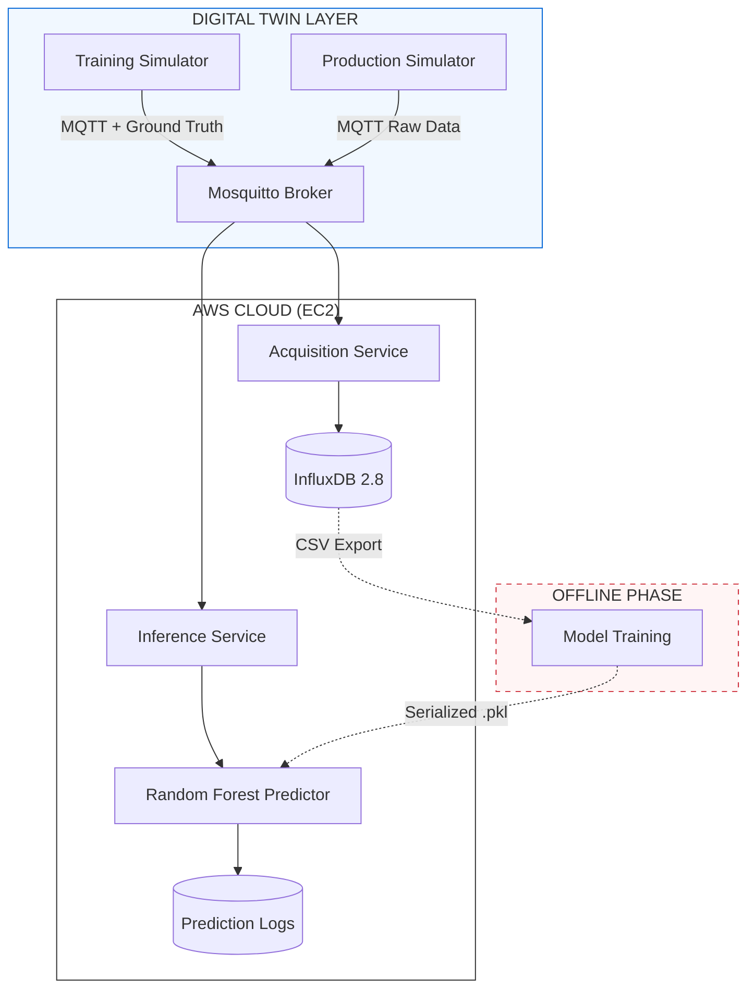

# 🏭 Industrial IoT & Cloud-Native Predictive Maintenance Pipeline

## Overview

This project implements an end-to-end **Cloud-Native Predictive Maintenance (PdM)** pipeline for industrial centrifugal pumps. The system has transitioned from hardware-based simulation to a fully containerized **Digital Twin Environment**.

Instead of static datasets, the pipeline uses high-fidelity Python simulators that model physical correlations (ISO 10816) and non-linear degradation curves. The architecture is a **Distributed Microservices Ecosystem** deployed on **AWS (EC2)**, designed for real-time scale (100+ devices).

---

## System Architecture & Microservices

The project is engineered as a decoupled microservices architecture, where the simulation layer and the processing layer communicate via a high-performance MQTT backbone.

### 🛰️ Simulation Layer (Digital Twin Engine)

* **Training Simulator**: Generates rapid, labeled datasets by simulating the entire lifecycle of a pump (from healthy to broken) using Weibull-based degradation. It includes `Ground Truth` labels for supervised learning.
* **Production Simulator**: Simulates real-time telemetry across different operational modes (`NOMINAL`, `ACCELERATED`, `STRESS`) and includes a **Chaos Engine** for robustness testing.
* **Direct Cloud Uplink**: Telemetry is transmitted via MQTT (QoS 1) to the AWS EC2 Broker.

### 🛠️ Service A: Acquisition & Training (Offline/Batch)

* **Role**: Data Lake management and Model Synthesis.
* **Workflow**:
1. **Ingestion**: A Python service consumes `training_data` topics.
2. **Storage**: High-performance time-series persistence in **InfluxDB 2.x**.
3. **Export**: A dedicated CLI tool (`export_training_data.py`) extracts balanced datasets from InfluxDB to CSV.
4. **Offline Training**: Data is transferred to a local workstation where Random Forest and StandardScaler models are synthesized using Scikit-Learn. This decoupled approach ensures that heavy ML computation does not impact the real-time cloud acquisition stability.

* **Output**: Serialized ML artifacts (`.pkl`: Scaler, Classifier, LabelEncoder).

### 🧠 Service B: Inference Service (Online/Real-Time)

* **Role**: Live Monitoring and Diagnostic Engine.
* **Hot-Loading**: The service "consumes" pre-trained models and performs real-time scaling and prediction on incoming raw MQTT streams.
* **Real-time Pipeline**: `Raw MQTT Data` → `StandardScaler` → `Random Forest Predictor` → `Persistent JSON/CSV Logs`.

---

## Preliminar Component Architecture

The diagram below highlights the separation between the **Training Data Generation** and the **Real-time Inference Service**.

---

## Chaos Engineering & Operational Modes

The **Production Simulator** includes a **Chaos Engine** to validate model robustness against unpredictable industrial events:

1. **Vibration Glitches**: Random spikes in `vibration_x` (sensor noise).
2. **Heatwave Drift**: Sudden +15°C temperature peaks.
3. **Operational Modes**:
* `NOMINAL`: Real-time wear simulation (~27 hours lifecycle).
* `ACCELERATED`: Compressed lifecycle (20 minutes).
* `STRESS`: Extreme conditions (2.5 minutes) for rapid pipeline testing.

---

## 🚀 Key Features

* **Ground Truth Injection**: The Training Simulator provides the "State" (HEALTHY, WARNING, FAULTY, BROKEN) for accurate model training.
* **Scalable Architecture**: Support for 100+ concurrent pump simulations using Python threading.
* **Cloud-Native & Dockerized**: Entirely managed via `docker-compose`, with environment-driven configurations.
* **Persistence**: Dual-layer storage (InfluxDB for telemetry, local volumes for predictions/CSV).

---

## 📦 Technology Stack

| Component | Technology | Role |
| --- | --- | --- |
| **Simulators** | Python 3.12 (Threading) | Digital Twin & Chaos injection |
| **Cloud Provider** | AWS (EC2) | Infrastructure hosting |
| **Broker** | Eclipse Mosquitto | MQTT message orchestration |
| **Database** | InfluxDB 2.8 | Time-series data lake |
| **Inference** | Scikit-Learn | Real-time ML Prediction |
| **Automation** | n8n | (Optional) Alerting & Orchestration |

---

## 🛤️ Project Roadmap

* [x] **Phase 1**: Python Digital Twin Simulators with Degradation logic.
* [x] **Phase 2**: Acquisition Service & InfluxDB integration.
* [x] **Phase 3**: Real-time Inference Service on AWS.
* [ ] **Phase 4**: Grafana Dashboards for Health Monitoring.
* [ ] **Phase 5**: Telegram Bot alerts for `FAULTY/BROKEN` states via n8n.

---

## 📄 Standards & Research Compliance

The simulated telemetry follows:

* **ISO 10816**: For vibration severity grading.
* **Weibull Distribution**: For modeling the "Bathtub Curve" of mechanical failure.

---
