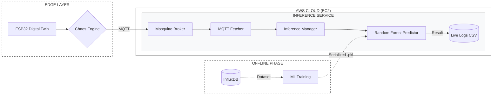

# 🏭 Industrial IoT & Cloud-Native Predictive Maintenance Pipeline

## 🎯 Overview

This project implements an end-to-end **Cloud-Native Predictive Maintenance (PdM)** pipeline for industrial centrifugal pumps. Instead of using static datasets, the system employs a **Digital Twin** approach: an ESP32 simulates a 5kW industrial pump, generating real-time telemetry based on physical correlations (ISO 10816 standards) and non-linear degradation curves (Weibull).

The architecture has evolved from simple data collection to a **Distributed Microservices Ecosystem** deployed on **AWS (EC2)**, capable of real-time inference and anomaly detection under stressed conditions.

---

## 🏗️ System Architecture & Microservices

The project is engineered as a **Distributed Microservices Architecture**, where the Edge layer communicates directly with the AWS Cloud infrastructure. The logic is decoupled into two independent services to ensure scalability and separation of concerns.

### 🛰️ Edge Layer (The Digital Twin)

* **ESP32 Core**: Acts as the physical data source, simulating complex industrial physics.
* **Direct Cloud Uplink**: Telemetry is transmitted via MQTT (QoS 1) directly to the AWS EC2 Elastic IP, bypassing local gateways to simulate a remote industrial site.
* **Firmware Scenarios**: Switchable logic between *Data Collection Mode* (with Ground Truth) and *Inference Mode* (Raw data + Chaos Engine).

### 🛠️ Service A: Acquisition & Training (Offline/Batch)

* **Role**: Data Lake management and Model Research.
* **Workflow**:
1. **Ingestion**: A dedicated Python service subscribes to telemetry + ground truth.
2. **Storage**: High-performance persistence in **InfluxDB**.
3. **Offline Training**: Machine Learning models are trained in a protected environment (local or dedicated container) using the exported historical data.

* **Output**: Serialized model artifacts (`.pkl` files: Scaler, Classifier, LabelEncoder).

### 🧠 Service B: Inference Service (Online/Real-Time)

* **Role**: Live Monitoring and Diagnostic Engine.
* **Deployment**: Production-ready Docker container on **AWS**.
* **Hot-Loading**: The service "consumes" the pre-trained models. It remains completely agnostic of the training logic, focusing exclusively on high-speed prediction.
* **Real-time Pipeline**:
`Raw MQTT Data` → `StandardScaler` → `Random Forest Predictor` → `Persistent CSV Logs`.

---

## 🔄 The Model Lifecycle (MLOps)

1. **Phase 1 (Discovery)**: The **Acquisition Service** runs to build the knowledge base.
2. **Phase 2 (Synthesis)**: Training is performed **offline** to optimize hyperparameters without consuming Cloud compute resources.
3. **Phase 3 (Deployment)**: Optimized models are "shipped" to the **Inference Service** on AWS.
4. **Phase 4 (Validation)**: The **Chaos Engine** on the ESP32 stress-tests the deployed models against unpredictable industrial noise.

---
Certamente, inserire il diagramma in una sezione dedicata rende il README estremamente professionale e facilita la comprensione immediata dell'architettura a chiunque legga il repository.

Ecco la sezione completa da aggiungere al tuo file:

---

## 🗺️ Visual Architecture

The following diagram illustrates the decoupled nature of the system at the current state, highlighting the separation between the **Real-time Inference Flow** (Online) and the **Model Training Pipeline** (Offline).

### Key Architectural Concepts:

* **Data Decoupling**: The ESP32 is completely unaware of the ML model; it simply streams physical parameters.
* **Artifact Injection**: The `.pkl` files (StandardScaler, Random Forest) are trained offline and "shipped" to the Cloud Inference Service. This allows for model updates without redeploying the entire infrastructure.
* **Resilience Testing**: The **Chaos Engine** acts as a middleware at the Edge, simulating sensor failures and environmental shifts before the data reaches the AWS Broker.

---

## ⚡ Chaos Engineering & Model Robustness

To validate the model beyond "perfect" simulations, the Edge firmware includes a **Chaos Engine** that triggers 5 industrial anomaly scenarios:

1. **Heatwave Drift**: Persistent +15°C ambient temperature increase.
2. **Mechanical Spike**: 12mm/s impulsive vibration glitches (sensor noise).
3. **Cavitation**: Hydraulic instability and pressure drops.
4. **Voltage Drop**: Electrical overcurrent with RPM loss.
5. **Sensor Freeze**: Simulating hardware failure (Vibration at 0).

---

## 🚀 Key Features

* **Microservices Decoupling**: Each service (Inference, Broker, Database) is independent. The system is designed to scale; adding a "Notification Service" or "Dashboard Service" requires zero downtime for the core engine.
* **Cloud-Native**: Optimized for AWS deployment with minimal disk footprint and efficient memory management.
* **Real-Time MLOps**: Automated pipeline from raw MQTT packets to labeled CSV predictions.
* **Scalable Configuration**: All parameters (MQTT topics, Model paths, AWS endpoints) are managed via environment variables.

---

## 🛤️ Project Roadmap

* [x] **Phase 1: Physical Simulation & InfluxDB Storage**
* [x] **Phase 2: Cloud Deployment & Real-time Inference Service**
* [x] **Phase 3: Chaos Engineering & Robustness Validation**
* [ ] **Phase 4: Async Notification Microservice (Twilio/Telegram Alerts)**
* [ ] **Phase 5: Grafana Dashboard Integration for Live Monitoring**

---

## 📦 Technology Stack

| Component | Technology | Role |
| --- | --- | --- |
| **Edge Device** | ESP32 (C++/Arduino) | Physical simulation & Chaos injection |
| **Cloud Provider** | AWS (EC2) | Infrastructure hosting |
| **Broker** | Eclipse Mosquitto | MQTT message orchestration |
| **Inference** | Python 3.12 + Scikit-Learn | Real-time ML Prediction |
| **Containerization** | Docker & Docker Compose | Microservices isolation & MLOps |

---

## 📄 Standards & Research Compliance

Telemetry is calibrated against:

* **ISO 10816**: Vibration severity zones for industrial machines.
* **API 610**: Centrifugal pumps for petroleum, petrochemical, and natural gas industries.

---

