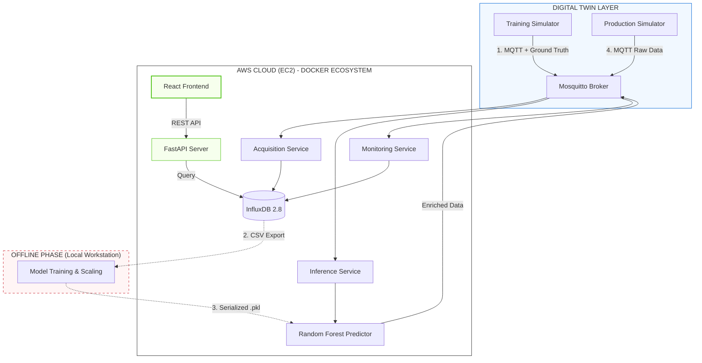

# 🏭 Industrial IoT & Cloud-Native Predictive Maintenance Pipeline

## Overview

This project implements an end-to-end **Cloud-Native Predictive Maintenance (PdM) pipeline** for industrial centrifugal pumps. The system has transitioned from hardware-based simulation to a fully containerized Digital Twin Environment.

The entire cloud infrastructure is provisioned and managed via Infrastructure as Code (IaC) using **Terraform**, ensuring a reproducible and automated deployment of the AWS (EC2) ecosystem. Instead of static datasets, the pipeline uses high-fidelity Python simulators that model physical correlations (ISO 10816) and non-linear degradation curves. The architecture is a **Distributed Microservices** Ecosystem designed for real-time scale (100+ devices).

---

## System Architecture & Microservices

The project is engineered as a decoupled microservices architecture, where the simulation layer and the processing layer communicate via a high-performance MQTT backbone.

### 🛰️ Simulation Layer (Digital Twin Engine)

* **Training Simulator**: Generates rapid, labeled datasets by simulating the entire lifecycle of a pump (from healthy to broken) using Weibull-based degradation. It includes `Ground Truth` labels for supervised learning.
* **Production Simulator**: Simulates real-time telemetry across different operational modes (`NOMINAL`, `ACCELERATED`, `STRESS`) and includes a **Chaos Engine** for robustness testing.
* **Direct Cloud Uplink**: Telemetry is transmitted via MQTT (QoS 1) to the AWS EC2 Broker.

### 🛠️ Service A: Acquisition & Training (Offline/Batch)

* **Role**: Data Lake management and Model Synthesis.
* **Workflow**:
1. **Ingestion**: A Python service consumes `training_data` topics.
2. **Storage**: High-performance time-series persistence in **InfluxDB 2.x**.
3. **Export**: A dedicated CLI tool (`export_training_data.py`) extracts balanced datasets from InfluxDB to CSV.
4. **Offline Training**: Data is transferred to a local workstation where Random Forest and StandardScaler models are synthesized using Scikit-Learn. This decoupled approach ensures that heavy ML computation does not impact the real-time cloud acquisition stability.

* **Output**: Serialized ML artifacts (`.pkl`: Scaler, Classifier, LabelEncoder).

### 🧠 Service B: Inference Service (Online/Real-Time)

* **Role**: Live Monitoring and Diagnostic Engine.
* **Hot-Loading**: The service "consumes" pre-trained models and performs real-time scaling and prediction on incoming raw MQTT streams.
* **Real-time Pipeline**: `Raw MQTT Data` → `StandardScaler` → `Random Forest Predictor` → `Persistent JSON/CSV Logs`.

### 📊 Service C: Monitoring Layer (Backend & Storage)

* **Technology**: FastAPI, InfluxDB 2.8.
* **Role**: The core data management hub.
* **Data Manager**: Persists telemetry and predictions into InfluxDB using optimized batch writes.
* **Core Manager**: Handles business logic, state filtering, and smart logging to highlight critical anomalies.
* **API Server**: Exposes REST endpoints (/api/v1/status) for the frontend.

### 💻 Service D: Presentation Layer (Frontend)

* **Technology**: React.js, Axios.
* **Role**: A dedicated operational dashboard for end-users.
* **Live Fleet Monitoring**: Automatic data refresh every 3 seconds.
* **Global Analytics: High-level** stats on total assets, average health, and failure counts.
* **Detail Views**: Expandable panels for deep-dives into sensory data (Vibration X/Y/Z, Pressure, Current).
  
---

## 🏗️ Integrated System Architecture & MLOps Workflow

The diagram below illustrates the complete lifecycle of the project: from the **Offline Training Phase** (using the Training Simulator and InfluxDB export) to the **Online Monitoring Phase** (where the Production Simulator feeds the live AI Dashboard).

```mermaid
graph TD
    subgraph Simulators ["DIGITAL TWIN LAYER"]
        A1[Training Simulator] -->|1. MQTT + Ground Truth| B
        A2[Production Simulator] -->|4. MQTT Raw Data| B
    end

    subgraph Infrastructure ["AWS CLOUD (EC2) - DOCKER ECOSYSTEM"]
        B[Mosquitto Broker]
        
        %% Acquisition & Training Path
        B --> C[Acquisition Service]
        C --> E[(InfluxDB 2.8)]
        
        %% Real-Time Inference Path
        B --> D[Inference Service]
        D --> F[Random Forest Predictor]
        F -->|Enriched Data| B
        
        %% Monitoring & UI Path
        B --> M[Monitoring Service]
        M --> E
        G[FastAPI Server] -->|Query| E
        H[React Frontend] -->|REST API| G
    end

    subgraph MLOps ["OFFLINE PHASE (Local Workstation)"]
        E -.->|2. CSV Export| I[Model Training & Scaling]
        I -.->|3. Serialized .pkl| F
    end

    %% Styling
    style Simulators fill:#f1f8ff,stroke:#0366d6,stroke-width:1px
    style Infrastructure fill:#fff,stroke:#333,stroke-width:1px
    style MLOps fill:#fff5f5,stroke:#cb2431,stroke-width:1px,stroke-dasharray: 5 5
    style H fill:#f6ffed,stroke:#52c41a,stroke-width:2px
    style G fill:#f6ffed,stroke:#52c41a,stroke-width:1px

```

---

### 🔄 Detailed Pipeline Breakdown

1. **Data Generation & Collection**: The **Training Simulator** generates high-fidelity datasets with labels (Ground Truth). These are collected via MQTT and stored in **InfluxDB**.
2. **Offline Model Synthesis**: Data is exported to a local environment to train the **Random Forest** model without impacting cloud performance. This results in serialized `.pkl` files.
3. **Model Deployment**: The trained artifacts are uploaded back to the **Inference Service** on AWS, enabling real-time diagnostics.
4. **Live Monitoring Loop**:
* The **Production Simulator** sends live telemetry.
* The **Inference Service** predicts the pump state and republishes it to the broker.
* The **Monitoring Service** saves everything to InfluxDB.
* The **React Frontend** fetches the processed data via the **FastAPI** gateway.

---

## Chaos Engineering & Operational Modes

The **Production Simulator** includes a **Chaos Engine** to validate model robustness against unpredictable industrial events:

1. **Vibration Glitches**: Random spikes in `vibration_x` (sensor noise).
2. **Heatwave Drift**: Sudden +15°C temperature peaks.
3. **Operational Modes**:
* `NOMINAL`: Real-time wear simulation (~27 hours lifecycle).
* `ACCELERATED`: Compressed lifecycle (20 minutes).
* `STRESS`: Extreme conditions (2.5 minutes) for rapid pipeline testing.

---

## 🚀 Key Features

* **Ground Truth Injection**: The Training Simulator provides the "State" (HEALTHY, WARNING, FAULTY, BROKEN) for accurate model training.
* **Scalable Architecture**: Support for 100+ concurrent pump simulations using Python threading.
* **Cloud-Native & Dockerized**: Entirely managed via `docker-compose`, with environment-driven configurations.
* **Persistence**: Dual-layer storage (InfluxDB for telemetry, local volumes for predictions/CSV).

---

### 📦 Technology Stack

| Component | Technology | Role |
| --- | --- | --- |
| **Simulators** | Python 3.12 (Threading) | Digital Twin & Chaos injection |
| **MLOps** | Scikit-Learn | Offline Training (Random Forest) |
| **Broker** | Eclipse Mosquitto | MQTT message orchestration |
| **Backend API** | FastAPI | High-performance REST API |
| **Frontend** | React 18 | Real-time Health Dashboard |
| **Storage** | InfluxDB 2.8 | Time-series Data Lake |

---

## 🛤️ Project Roadmap & Future Evolutions

* **Phase 1**: Python-based Digital Twin Simulators with advanced degradation logic.
* **Phase 2**: Cloud Acquisition Service & InfluxDB 2.8 time-series integration.
* **Phase 3**: Real-time Inference Engine on AWS (Random Forest deployment).

### Current Step: Real-Time Monitoring Microservice

The upcoming evolution focuses on a centralized monitoring dashboard to visualize pump health and system telemetry. Two architectural paths are under consideration:

* **Path A (Integrated Dashboarding)**: Leveraging **Grafana** connected directly to InfluxDB, with an MQTT data fetcher to bridge inference results into visual panels. This provides a professional-grade, rapid-deployment monitoring solution.
* **Path B (Custom Full-Stack)**: Developing a dedicated monitoring portal using **React.js** for the frontend, powered by a **FastAPI** backend. This microservice will expose APIs to fetch live inference data, store historical predictions in a relational database, and provide custom data export features.

---

### 🛡️ Next Developments: Security & Access Control

The current architecture is optimized for functional validation; however, moving toward an industrial deployment requires a robust security layer. The following enhancements are planned:

* **API Security (JWT Bearer Tokens)**: Implementing **OAuth2 with Password Flow and JWT (JSON Web Tokens)** to protect FastAPI endpoints. This ensures that only authenticated clients (or services) can fetch fleet telemetry or trigger diagnostic exports.
* **Frontend Guarding**: Integrating **React Context and Protected Routes** to prevent unauthorized access to the Monitoring Dashboard.
* **Infrastructure Hardening**: Utilizing **Terraform** to further restrict AWS Security Groups, implementing a **Private Subnet** for the database and broker, and exposing only the Frontend/API Gateway via an encrypted **HTTPS (TLS)** listener.

---
